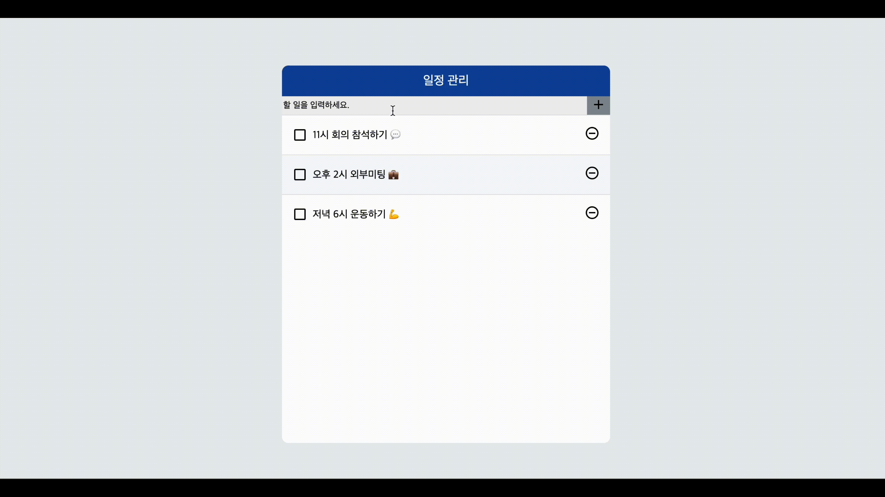

# 리액트를 이용한 일정관리 웹 애플리케이션 
 

### 기술스택 
- React Hook
- JS(ES6+)
- HTML5
- PostCSS
<br/><br/>

### 프로젝트 구조 
```bash
├── App
│   ├── TodoTemplate
│   ├── TodoInsert
│   └── TodoList
│       └── TodoListItem
``` 
<br/>

### 구현한 방법과 이유에 대한 간략한 내용
React Hook과 PostCSS로 구현한 일정 관리 웹 애플리케이션입니다.
<br>
📖 첫 번째 구현 시 `리액트를 다루는 기술` 책을 보고 공부하며 구현하였습니다.   
📖 두 번째 구현 시에 다시 초기 상태로 만든 후 혼자 만들어 보았습니다.
<br/>
<br/>

### 구현하면서 어려웠던 점과 해결 방법 (Error Handling Log)
1. prosp, state  
막상 초기 상태에서 프로젝트를 구현하려고 하니 todos에 새로운 todo를 어떻게 넣어야 할지 막막했습니다. 프로젝트 구조를 그려보며 App에서 todos,setTodos를 처리하고 새로운 todo가 생겨도 이곳에서 처리해 줘야겠다는 아이디어가 떠올라 로직을 구성했습니다. 


2. checkbox의 상태에 따른 CSS처리   
[todoListItem.jsx ]
```
import styles from '../todoListItem/todoListItem.module.css';

...

<div className={`${styles.text} ${checked ? styles.checked : ''}`} >
  {text}
</div>
``` 
기존에 SASS로 구현했을 때는 겪지 않았던 어려움인데 PostCSS로 바꾼 후에 위의 코드를 처리하는 부분에서 텍스트에 취소 선이 먹지 않는 현상이 생겼습니다.
처음에 아래와 같이 했기에
```
<div className={`${styles.text} ${checked ? 'checked' : ''}`} >
  {text}
</div>
```
styles에 반영되지 않았던 것으로 파악하고 오류를 해결했습니다. 

3. useCallback, useMemo, useState   
React를 공부하면서 제일 와닿지 않았던 것은 각종 Hooks 들이었습니다. useState, useEffect, useMemo, useCallback등 용어의 의미가 직관적으로 다가오지 않았고, 클래스형 라이프사이클 메소드와 개념이 섞여버렸습니다. 제대로 일기 위해 hooks를 기술 블로그에 정리하면서 개념을 정확하게 이해하게 되었습니다.<br/>
[개인 기술블로그에 hook를 정리한 주소](https://salangdung.tistory.com/267)